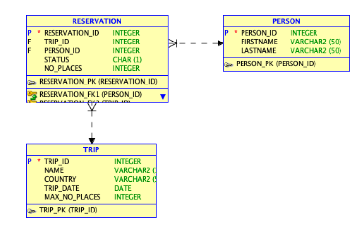

# Trip organization database - Oracle SQL
In order to generate this database on your own use base_generation.sql file. It
contains the modified versions of procedures (see the last paragraph).

## Scheme

Contraint:
 * field **STATUS** can include following values:
   * n - new
   * p - paid
   * c - cancelled

## Creating tables

### a) table PERSON
    create table person
    (
    person_id int generated always as identity not null, 
    firstname varchar2(50), 
    lastname varchar2(50),
    constraint person_pk primary key
        (person_id)
        enable
    );
### b) table TRIP

    create table trip
    (
    trip_id int generated always as identity not null, 
    name varchar2(100), 
    country varchar2(50), 
    trip_date date, 
    max_no_places int, 
    constraint trip_pk primary key
        (trip_id)
        enable
    );

    alter table TRIP
    add constraint trip_no check ( MAX_NO_PLACES > 0 );

### c) table RESERVATION

    create table reservation
    (
    reservation_id int generated always as identity not null, 
    trip_id int, 
    person_id int, 
    status char(1), 
    no_places int, 
    constraint reservation_pk primary key
        (reservation_id)
        enable
    );
    
    
    alter table reservation
    add constraint reservation_fk1 foreign key
        (person_id)
        references person
        (person_id)
        enable;
    alter table reservation
    add constraint reservation_fk2 foreign key
        (trip_id)
        references trip
        (trip_id)
        enable;
    

    alter table reservation
    add constraint reservation_chk1 check
        (status in ('n','p','c'))
        enable;

    alter table reservation
    add constraint reservation_no check ( NO_PLACES > 0 );
    
### d) table LOG

    create table log
    (
    person_id int,
    reservation_id int,
    log_date date,
    status char,
    no_places int
    );
    

    alter table log
    add constraint log_chk1 check
        (status in ('n','p','c'))
        enable;

## Inserting test data

    insert into reservation(trip_id, person_id, no_places, status)
    values (2,6,1,'c');
    insert into reservation(trip_id, person_id, no_places, status)
    values (3,8,2,'p');
    insert into reservation(trip_id, person_id, no_places, status)
    values (4,3,1,'n');
    insert into reservation(trip_id, person_id, no_places, status)
    values (4,1,1,'c');
    insert into reservation(trip_id, person_id, no_places, status)
    values (1,3,1,'n');
    insert into reservation(trip_id, person_id, no_places, status)
    values (1,1,1,'n');
    insert into reservation(trip_id, person_id, no_places, status)
    values (2,1,1,'p');

    
    insert into trip (name, country, trip_date, max_no_places)
    values ('wycieczka do londynu','angila',to_date('2022-03-14','yyyy-mm-dd'),2);
    insert into trip (name, country, trip_date, max_no_places)
    values ('wycieczka do usa','usa',to_date('2020-03-23','yyyy-mm-dd'),1);
    insert into trip (name, country, trip_date, max_no_places)
    values ('wycieczka do paryza','francja',to_date('2021-09-03','yyyy-mm-dd'),3);
    insert into trip (name, country, trip_date, max_no_places)
    values ('wycieczka do krakowa','polska',to_date('2022-12-05','yyyy-mm-dd'),2);

    
    insert into person (firstname, lastname)
    values('greg', 'rogz');
    insert into person (firstname, lastname)
    values('garek', 'majcki');
    insert into person (firstname, lastname)
    values('natalia', 'warda');
    insert into person (firstname, lastname)
    values('waclaw', 'hyhy');
    insert into person (firstname, lastname)
    values('adam', 'bielczycki');
    insert into person (firstname, lastname)
    values('jan', 'nowak');
    insert into person (firstname, lastname)
    values('michal', 'aniol');
    insert into person (firstname, lastname)
    values('leo', 'corde');
    insert into person (firstname, lastname)
    values('adam', 'kowalski');
    insert into person (firstname, lastname)
    values('jan', 'nowak');

## Defining user-defined types

    create or replace type TripParticipantObject as object (
       firstname varchar2(50),
       lastname varchar2(50),
       tripID number,
       reservationId number,
       numberOfPlaces number,
       status char
    );
    
    
    create or replace type TripParticipantsTable is table of TripParticipantObject;
    
    
    create or replace type PersonReservationsObject as object (
       tripID number,
       reservationId number,
       numberOfPlaces number,
       status char,
       country varchar2(50),
       tripDate date
    );
    
    
    create or replace type PersonReservationsTable is table of PersonReservationsObject;
    
    
    create or replace type AvailableTripsObject as object (
       tripID number,
       name varchar2(100),
       country varchar2(50),
       tripDate date,
       numberOfPlaces number
    );
    
    create or replace type AvailableTripsTable is table of AvailableTripsObject;

## Creating views

### a) reservations(country, trip_date,trip_name, firstname, lastname, reservation_id, no_places, status)

    create or replace view reservations
    as
    select TRIP.TRIP_ID, COUNTRY, TRIP_DATE, NAME, FIRSTNAME, LASTNAME, RESERVATION_ID, NO_PLACES, STATUS
    from TRIP
    inner join RESERVATION R on TRIP.TRIP_ID = R.TRIP_ID
    inner join PERSON P on P.PERSON_ID = R.PERSON_ID;

### b) trips(country, trip_date, trip_name, max_no_places, no_available_places)

    create or replace view trips
    as
    select TRIP_ID, COUNTRY, TRIP_DATE, NAME, MAX_NO_PLACES, GETFREEPLACES(TRIP_ID) as "AvailablePlaces"
    from TRIP;

### c) available_trips(country, trip_date, trip_name, no_places, no_available_places)

    create or replace view availableTrips
    as
    select *
    from TRIPS
    where "AvailablePlaces" > 0 and TRIP_DATE > sysdate;

## Auxiliary functions

### a) validation functions

    create function isTripValid (
       tripID number
    )
    return number
    as
       valid int;
       begin
           select count(*)
           into valid
           from TRIP
           where TRIP_ID = tripID;

           return valid;
       end;
    

    create function isPersonValid (
       personID PERSON.person_id%type
    )
    return number
    as
       valid int;
       begin
           select count(*)
           into valid
           from PERSON
           where PERSON_ID = personID;

           return valid;
       end;

    create function isReservationValid (
       reservationID RESERVATION.RESERVATION_ID%type
    )
    return number
    as
       valid int;
       begin
           select count(*)
           into valid
           from RESERVATION
           where RESERVATION_ID = reservationID;
           return valid;
       end;

### b) free and booked places

    create function getBookedPlaces (
       tripID TRIP.trip_id%type
    )
    return RESERVATION.NO_PLACES%type
    as
       numberBookedPlaces RESERVATION.NO_PLACES%type;
       begin
           if ISTRIPVALID(tripID) = 0 then
               raise_application_error(-200001, 'tripID not found');
           end if;
           select nvl(sum(NO_PLACES), 0)
           into numberBookedPlaces
           from RESERVATION
           where TRIP_ID = tripID and STATUS != 'c';
    
           return numberBookedPlaces;
       end;
    
    
    create function getFreePlaces (
       tripID TRIP.trip_id%type
    )
    return RESERVATION.NO_PLACES%type
    as
       numberFreePlaces RESERVATION.NO_PLACES%type;
       begin
           if ISTRIPVALID(tripID) = 0 then
               raise_application_error(-200001, 'tripID not found');
           end if;
           select MAX_NO_PLACES - GETBOOKEDPLACES(tripID)
           into numberFreePlaces
           from TRIP
           where TRIP_ID = tripID;
    
           return numberFreePlaces;
       end;

## Main functions

### a) trip_participants(trip_id)

    create function getTripParticipants (
       tripID Trip.trip_id%type
    )
    return TRIPPARTICIPANTSTABLE
    as
       result TRIPPARTICIPANTSTABLE;
       begin
           if ISTRIPVALID(tripID) = 0 then
               raise_application_error(-20001, 'tripID not found');
           end if;
           select TRIPPARTICIPANTOBJECT(firstname, lastname, tripID, R.RESERVATION_ID, R.NO_PLACES, R.status)
           bulk collect
           into result
           from RESERVATIONS
           inner join RESERVATION R on RESERVATIONS.RESERVATION_ID = R.RESERVATION_ID
           where R.TRIP_ID = tripID and RESERVATIONS.STATUS != 'c';
    
           return result;
       end;

### b) person_reservations(person_id)

    create function getPersonReservations (
       personID Person.PERSON_ID%type
    )
    return PERSONRESERVATIONSTABLE
    as
       result PERSONRESERVATIONSTABLE;
       begin
           if ISPERSONVALID(personID) = 0 then
               raise_application_error(-20001, 'personID not found');
           end if;
           select PERSONRESERVATIONSOBJECT(T.TRIP_ID, RESERVATION_ID, NO_PLACES, STATUS, COUNTRY, TRIP_DATE)
           bulk collect
           into result
           from RESERVATION
           inner join TRIP T on T.TRIP_ID = RESERVATION.TRIP_ID
           where PERSON_ID = personID;
    
           return result;
       end;

### c) available_trips_to(country, date_from, date_to)

    create function getAvailableTrips (
       destinationCountry varchar2,
       startDate date,
       endDate date
    )
    return AVAILABLETRIPSTABLE
    as
       result AVAILABLETRIPSTABLE;
       begin
           select AVAILABLETRIPSOBJECT(TRIP_ID, NAME, COUNTRY, TRIP_DATE, MAX_NO_PLACES)
           bulk collect
           into result
           from TRIP
           where COUNTRY = destinationCountry and startDate <= TRIP_DATE and TRIP_DATE <= endDate;
    
           return result;
       end;

## Procedures (with control of places)

### a) add_reservation(trip_id, person_id,no_places)

    create procedure addReservation(
       tripID int,
       personID int,
       numberOfPlaces int
    )
    as
       freePlaces trips.MAX_NO_PLACES%type;
       tripDate trips.TRIP_DATE%type;
    begin
       if ISPERSONVALID(personID) = 0 then
          raise_application_error(-20001, 'personID not found');
       end if;
       if ISTRIPVALID(tripID) = 0 then
          raise_application_error(-20001, 'tripID not found');
       end if;
       select TRIP_DATE into tripDate from TRIPS where TRIP_ID = tripID;
       if (tripDate < sysdate) then
           raise_application_error(-20001, 'trip has already taken place');
       end if;
       select "AvailablePlaces" into freePlaces from TRIPS where TRIP_ID = tripID;
       if (numberOfPlaces > freePlaces) then
            raise_application_error(-20001, 'not enough free places for this trip');
       end if;
       insert into RESERVATION (trip_id, person_id, status, no_places) 
       values (tripID, personID, 'n', numberOfPlaces);
       commit;
    end;

### b) modify_reservation_status(reservation_id, status)

    create procedure modifyReservationStatus(
       reservationID number,
       newStatus char
    )
    as
       freePlaces trips.MAX_NO_PLACES%type;
       reservationPlaces trips.MAX_NO_PLACES%type;
       tripID TRIP.TRIP_ID%type;
       oldStatus RESERVATION.STATUS%type;
    begin
       if ISRESERVATIONVALID(reservationID) = 0 then
          raise_application_error(-20001, 'reservationID not found');
       end if;
       select TRIP_ID into tripID from RESERVATION where RESERVATION_ID = reservationID;
       select STATUS into oldStatus from RESERVATION where RESERVATION_ID = reservationID;
       select "AvailablePlaces" into freePlaces from TRIPS where TRIP_ID = tripID;
       if (oldStatus = 'c') then
           if (reservationPlaces > freePlaces) then
               raise_application_error(-20001, 'not enough free places');
           end if;
       end if;
       update RESERVATION R set R.STATUS = newStatus
       where RESERVATION_ID = reservationID;
       commit;
    end;

### c) modify_reservation(reservation_id, no_places)

    create procedure modifyReservation(
       reservationID RESERVATION.RESERVATION_ID%type,
       newPlaces RESERVATION.NO_PLACES%type
    )
    as
       freePlaces trips.MAX_NO_PLACES%type;
       oldPlaces RESERVATION.NO_PLACES%type;
       tripID TRIP.TRIP_ID%type;
    begin
       if ISRESERVATIONVALID(reservationID) = 0 then
          raise_application_error(-20001, 'reservationID not found');
       end if;
       select TRIP_ID into tripID from RESERVATIONS where RESERVATION_ID = reservationID;
       select "AvailablePlaces" into freePlaces from TRIPS where TRIP_ID = tripID;
       select NO_PLACES into oldPlaces from RESERVATION where RESERVATION_ID = reservationID;
       if (newPlaces > oldPlaces) then
           if (newPlaces - oldPlaces > freePlaces) then
               raise_application_error(-20001, 'not enough places');
           end if;
       end if;
       update RESERVATION R set R.NO_PLACES = newPlaces
       where RESERVATION_ID = reservationID;
       commit;
    end;

### d) modify_max_no_places(trip_id, no_places)

    create procedure modifyMaxNumberOfPlaces(
       tripID TRIP.TRIP_ID%type,
       newMax TRIP.MAX_NO_PLACES%type
    )
    as
       takenPlaces RESERVATIONS.NO_PLACES%type;
       oldMax TRIP.MAX_NO_PLACES%type;
    begin
       if ISTRIPVALID(tripID) = 0 then
          raise_application_error(-20001, 'tripID not found');
       end if;
       select MAX_NO_PLACES into oldMax from TRIPS where TRIP_ID = tripID;
       if (newMax < oldMax) then
           select (oldMax - "AvailablePlaces") into takenPlaces from TRIPS where TRIP_ID = tripID;
           if (newMax < takenPlaces) then
               raise_application_error(-20001, 'new limit too small for current reservations');
           end if;
       end if;
       update TRIP set MAX_NO_PLACES = newMax where TRIP_ID = tripID;
       commit;
    end;

## Triggers

    create trigger onReservationChange
       after insert or update
       on RESERVATION
       for each row
    begin
       insert into LOG (PERSON_ID, RESERVATION_ID, LOG_DATE, STATUS, NO_PLACES)
       values (:new.PERSON_ID, :new.RESERVATION_ID, sysdate, :new.STATUS,
       :new.NO_PLACES);
    end;

## **!Modification of previous strategy!**
We transfer checking available places for a trip from given procedures to triggers.

## Procedures (modified)
### a) add_reservation(trip_id, person_id,no_places)
    create procedure addReservation(
       tripID int,
       personID int,
       numberOfPlaces int
    )
    as
       tripDate trips.TRIP_DATE%type;
    begin
       if ISPERSONVALID(personID) = 0 then
          raise_application_error(-20001, 'personID not found');
       end if;
       if ISTRIPVALID(tripID) = 0 then
          raise_application_error(-20001, 'tripID not found');
       end if;
       select TRIP_DATE into tripDate from TRIPS where TRIP_ID = tripID;
       if (tripDate < sysdate) then
           raise_application_error(-20001, 'trip has already taken place');
       end if;
       insert into RESERVATION (trip_id, person_id, status, no_places) values (tripID, personID, 'n', numberOfPlaces);
       commit;
    end;

### b) modify_reservation_status(reservation_id, status)
    create procedure modifyReservationStatus(
       reservationID number,
       newStatus char
    )
    as
    begin
       if ISRESERVATIONVALID(reservationID) = 0 then
          raise_application_error(-20001, 'reservationID not found');
       end if;
       update RESERVATION R set R.STATUS = newStatus
       where RESERVATION_ID = reservationID;
       commit;
    end;
### c) modify_reservation(reservation_id, no_places)
    create procedure modifyReservation(
       reservationID RESERVATION.RESERVATION_ID%type,
       newPlaces RESERVATION.NO_PLACES%type
    )
    as
    begin
       if ISRESERVATIONVALID(reservationID) = 0 then
          raise_application_error(-20001, 'reservationID not found');
       end if;
       update RESERVATION R set R.NO_PLACES = newPlaces
       where RESERVATION_ID = reservationID;
       commit;
    end;

### d) modify_max_no_places(trip_id, no_places)

    create procedure modifyMaxNumberOfPlaces(
       tripID TRIP.TRIP_ID%type,
       newMax TRIP.MAX_NO_PLACES%type
    )
    as
    begin
       if ISTRIPVALID(tripID) = 0 then
          raise_application_error(-20001, 'tripID not found');
       end if;
       update TRIP set MAX_NO_PLACES = newMax where TRIP_ID = tripID;
       commit;
    end;

## Triggers
### onAddReservation
    create or replace trigger onAddReservation
       before insert on RESERVATION
       for each row
    declare
       pragma autonomous_transaction;
       freePlaces number;
    begin
       select "AvailablePlaces" into freePlaces from TRIPS where TRIP_ID = :new.TRIP_ID;
       if (:new.NO_PLACES > freePlaces) then
           raise_application_error(-20001, 'not enough free places for this trip');
       end if;
    end;
### onChangeStatus
    create or replace trigger onChangeStatus
       before update on RESERVATION
       for each row
    declare
       pragma autonomous_transaction;
       freePlaces number;
    begin
       select "AvailablePlaces" into freePlaces from TRIPS where TRIP_ID = :new.TRIP_ID;
       if (:old.STATUS = 'c') then
           if (:old.NO_PLACES > freePlaces) then
               raise_application_error(-20001, 'not enough free places');
           end if;
       end if;
    end;
### onChangeReservation
    create or replace trigger onChangeReservation
       before update on RESERVATION
       for each row
    declare
       pragma autonomous_transaction;
       freePlaces number;
    begin
       select "AvailablePlaces" into freePlaces from TRIPS where TRIP_ID = :new.TRIP_ID;
       if (:new.NO_PLACES > :old.NO_PLACES) then
           if (:new.NO_PLACES - :old.NO_PLACES > freePlaces) then
               raise_application_error(-20001, 'not enough places');
           end if;
       end if;
    end;
### onChangeMaxPlaces
    create or replace trigger onChangeMaxPlaces
       before update on TRIP
       for each row
    declare
       pragma autonomous_transaction;
       takenPlaces number;
    begin
       if (:new.MAX_NO_PLACES < :old.MAX_NO_PLACES) then
           select (:old.MAX_NO_PLACES - "AvailablePlaces") into takenPlaces from TRIPS where TRIP_ID = :new.TRIP_ID;
           if (:new.MAX_NO_PLACES < takenPlaces) then
               raise_application_error(-20001, 'new limit too small for current reservations');
           end if;
       end if;
    end;

